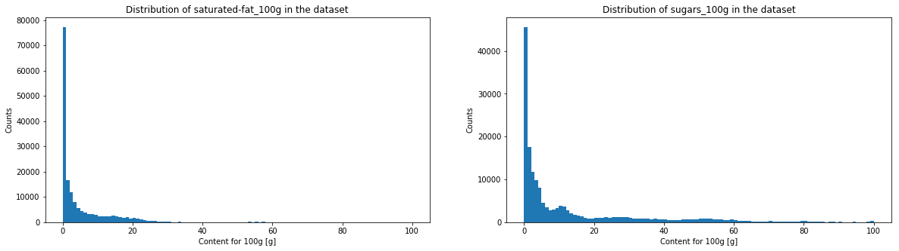

## Data Visualisation
### Histograms
We will now plot histograms of the data, as well as scatterplots and correlations. As there are numerous different histograms to plot, we serialize this process.

The histogramms of sugar, fat, saturate fat, salt, sodium, fiber and proteins have a very similar aspect. We will see in the following graph if it corresponds to a power law.
    
The energy histogram is a bit more spread in higher values. Both fruits/vegetables/nuts content indices look very destructured, but this is not surprising since most of these values are estimates. Moreover, the threshold used by the Nutri-Score algorithm to attribute a score in function of the fruits/vegetables/nuts content makes a distinction at various thresholds (<40%, >40%, >60% and >80%), which means that one can observe an important threshold effet. Moreover, there is no clear convention about how theses fruit/vegetables/nuts contents have to be made. Still, thanks to these verges, estimation of fruit content do not have to be extremely precise.

One can see that salt and sodium content may represent a power law, caracterised by the straight segment. Fiber and sugar also have somehow a similar aspect. On the contrary, for proteins, fats and saturated fats, one will be able observe a horizontal line at the beginning and a drop in the counts at the end. 

### Correlations

<table border="1" class="dataframe">
  <thead>
    <tr style="text-align: right;">
      <th></th>
      <th>energy_100g</th>
      <th>fat_100g</th>
      <th>saturated-fat_100g</th>
      <th>sugars_100g</th>
      <th>salt_100g</th>
      <th>sodium_100g</th>
      <th>fruits-vegetables-nuts_100g</th>
      <th>fruits-vegetables-nuts-estimate_100g</th>
      <th>fiber_100g</th>
      <th>proteins_100g</th>
    </tr>
  </thead>
  <tbody>
    <tr>
      <th>energy_100g</th>
      <td>1.000000</td>
      <td>0.817869</td>
      <td>0.626831</td>
      <td>0.319871</td>
      <td>-0.023507</td>
      <td>-0.023510</td>
      <td>-0.171717</td>
      <td>-0.245808</td>
      <td>0.229026</td>
      <td>0.271525</td>
    </tr>
    <tr>
      <th>fat_100g</th>
      <td>0.817869</td>
      <td>1.000000</td>
      <td>0.733552</td>
      <td>-0.033292</td>
      <td>-0.003381</td>
      <td>-0.003385</td>
      <td>-0.166035</td>
      <td>-0.200962</td>
      <td>0.065585</td>
      <td>0.169655</td>
    </tr>
    <tr>
      <th>saturated-fat_100g</th>
      <td>0.626831</td>
      <td>0.733552</td>
      <td>1.000000</td>
      <td>0.061045</td>
      <td>-0.006936</td>
      <td>-0.006938</td>
      <td>-0.223890</td>
      <td>-0.239060</td>
      <td>0.027153</td>
      <td>0.168513</td>
    </tr>
    <tr>
      <th>sugars_100g</th>
      <td>0.319871</td>
      <td>-0.033292</td>
      <td>0.061045</td>
      <td>1.000000</td>
      <td>-0.077787</td>
      <td>-0.077780</td>
      <td>0.074202</td>
      <td>0.009511</td>
      <td>0.047744</td>
      <td>-0.194738</td>
    </tr>
    <tr>
      <th>salt_100g</th>
      <td>-0.023507</td>
      <td>-0.003381</td>
      <td>-0.006936</td>
      <td>-0.077787</td>
      <td>1.000000</td>
      <td>0.999999</td>
      <td>-0.101725</td>
      <td>-0.050666</td>
      <td>-0.004311</td>
      <td>0.063660</td>
    </tr>
    <tr>
      <th>sodium_100g</th>
      <td>-0.023510</td>
      <td>-0.003385</td>
      <td>-0.006938</td>
      <td>-0.077780</td>
      <td>0.999999</td>
      <td>1.000000</td>
      <td>-0.101723</td>
      <td>-0.050664</td>
      <td>-0.004314</td>
      <td>0.063649</td>
    </tr>
    <tr>
      <th>fruits-vegetables-nuts_100g</th>
      <td>-0.171717</td>
      <td>-0.166035</td>
      <td>-0.223890</td>
      <td>0.074202</td>
      <td>-0.101725</td>
      <td>-0.101723</td>
      <td>1.000000</td>
      <td>0.999981</td>
      <td>0.134036</td>
      <td>-0.214541</td>
    </tr>
    <tr>
      <th>fruits-vegetables-nuts-estimate_100g</th>
      <td>-0.245808</td>
      <td>-0.200962</td>
      <td>-0.239060</td>
      <td>0.009511</td>
      <td>-0.050666</td>
      <td>-0.050664</td>
      <td>0.999981</td>
      <td>1.000000</td>
      <td>0.144027</td>
      <td>-0.205393</td>
    </tr>
    <tr>
      <th>fiber_100g</th>
      <td>0.229026</td>
      <td>0.065585</td>
      <td>0.027153</td>
      <td>0.047744</td>
      <td>-0.004311</td>
      <td>-0.004314</td>
      <td>0.134036</td>
      <td>0.144027</td>
      <td>1.000000</td>
      <td>0.183465</td>
    </tr>
    <tr>
      <th>proteins_100g</th>
      <td>0.271525</td>
      <td>0.169655</td>
      <td>0.168513</td>
      <td>-0.194738</td>
      <td>0.063660</td>
      <td>0.063649</td>
      <td>-0.214541</td>
      <td>-0.205393</td>
      <td>0.183465</td>
      <td>1.000000</td>
    </tr>
  </tbody>
</table>

There are many interesting correlations. 

The energy is highly correlated to fat and saturated fat, and moderately to sugar, fiber and proteins. This is a coherent correlation as it is those nutrients which are the source of energy.
Saturated fat is highly correlated to fat as the first is a subcategory of the second.
Sodium and salt are perfectly correlated as the salt/sodium ratio is fixed, with a proportion of 2.5.
Both fruits/vegs/nuts contents, real and estimated, are perfectly correlated due to the cleaning. Estimated fruits content has a moderated negative correlation with energy, fat and saturated fat. But it is interesting to notice that both fruits/veg/nuts and sugar contents and are not correlated according to these data even if, in the reality, the fruits/veg/nuts content increases sugars content of a product. 

### Scatter plot

We used these scatter plots in order to obtain new insights about the data and get cues about the cleaning possibilites.

The dirty fat-to-energy plot shows a triangular shape. The lower side has a slope of 37 kJ, which corresponds to the energy density of a gram of fat. The triangular shape comes from a high sparsity among the low fat values. This phenomenon is due to the presence of sugar, proteins and fibers that also contribute to the energy of a product. As the amount of fat increases, it becomes the main source of energy. The cleaning sets a minimum energy amount, based on the other nutrients values, to which a constant is substracted, as an error margin.

The other graphs have similar behaviour. The slopes are 17 for sugar and proteins and 8 for fibers.

One can observe that the most important cleaning of the database occurs before its filling. Indeed, the distribution found in the scatter plot is identical if one compare it to the corresponding scatter plot before the automatic filling process.

The dirty scatter plot indicates that some product have a higher value of saturated fat than the value of total fat, which is of course impossible. As the criterion used in Nutri-Score is the amount of saturated fat, we then set for erroneous product the amount of fat up to the amount of saturated fat. This is a conservative way of cleaning as it tends to penalize products.

The slope of the scatter plot is 2.5 as expected. Most of the data is clean, changes are minor.

This displays mostly the completion during the cleaning part.

#### Beverages products analysis

Here, one can see the scatter plot for product that will be considered as beverages by the NutriScore algorithm. One can observe that most of beverages have low-level of fats but are more sparse concerning sugars and proteins. One can see that the product graded E (worst grade) have the largest value in terms of energy, sugars and proteins and frequently contain less than 50% of fruits/vegetables/nuts. The differences between the other grades (A, B, C & D) are less noticeable. If we had to separate them using machine learning techniques, it would have been difficult. This is why we preferred to directly develop a calculation algorithm based on the official Nutri-Score computation rules.

#### Non-beverages products analysis

One can observe that the products graded C/D/E have very similar properties. They show a large scale of values for what concerns fats and sugars. But one should note, looking at the fruits/veg/nuts content vs energy plot, that it is possible to differentiate the grades according to their energy content, as one can observe several layers. Grade A have a larger amount of fiber, which seems to make sense, as fiber give negative points for the Nutri-Score (NB : the lower the NutriScore, the better the grade).

### NutriScore - Computation

As stated above, we developped our NutriScore computation algorithm using the exact criteria specified in the official documents from the french Ministry of Agriculture. As the products effective grade are indicated in the database, we can quantify the accuracy of the algorithm and try to increase its efficiency.

In general, except for exceptions, the score is computed in this manner :  
ScoreBeverages =  Energy + Sugar - Fruits 
ScoreNonBeverages = NegativePoints - PositivePoints = (Energy + Fat + Sugar + Sodium) - (Fruits + Fibers + Proteins) 

For beverages grades: 
Water ==>  A 
ScoreBeverages <= 1 ==> B 
1 < ScoreBeverages <= 5 ==> C 
5 < ScoreBeverages <= 9 ==> D 
9 < ScoreBeverages <= 20 ==> E 

For non-beverages grades: 
ScoreNonBeverages < 0 ==> A 
0 < ScoreNonBeverages <= 2 ==> B 
2 < ScoreNonBeverages <= 10 ==> C 
10 < ScoreNonBeverages <= 18 ==> D 
18 < ScoreNonBeverages <= 40 ==> E 

    83.72 % of product in our final database have Nutri-Score provided by OpenFoodFacts
    

<table border="1" class="dataframe">
  <thead>
    <tr style="text-align: right;">
      <th></th>
      <th>a</th>
      <th>b</th>
      <th>c</th>
      <th>d</th>
      <th>e</th>
      <th>Error</th>
    </tr>
  </thead>
  <tbody>
    <tr>
      <th>a</th>
      <td>18314</td>
      <td>849</td>
      <td>81</td>
      <td>11</td>
      <td>10</td>
      <td>80</td>
    </tr>
    <tr>
      <th>b</th>
      <td>2916</td>
      <td>15828</td>
      <td>671</td>
      <td>57</td>
      <td>65</td>
      <td>306</td>
    </tr>
    <tr>
      <th>c</th>
      <td>1001</td>
      <td>2981</td>
      <td>24035</td>
      <td>822</td>
      <td>149</td>
      <td>305</td>
    </tr>
    <tr>
      <th>d</th>
      <td>185</td>
      <td>319</td>
      <td>6855</td>
      <td>32902</td>
      <td>353</td>
      <td>498</td>
    </tr>
    <tr>
      <th>e</th>
      <td>9</td>
      <td>72</td>
      <td>959</td>
      <td>3387</td>
      <td>26687</td>
      <td>330</td>
    </tr>
    <tr>
      <th>Error</th>
      <td>0</td>
      <td>0</td>
      <td>0</td>
      <td>0</td>
      <td>0</td>
      <td>0</td>
    </tr>
  </tbody>
</table>

The columns indicate the predicted grade and the rows the true grade.

    For Beverages :
    
    The accuracy according to the grade is 87.33 %, the accuracy according to the score is 54.05 %.
    
    
The fact that the score accuracy is much lower than the grade accuracy might be explained by the way our algorithm compute the grade for water. Only mineral waters can have the grade A, and all mineral waters have this grade. As a consequence, our algorithm focuses on the tags and not on the score computation.

    For non-Beverages :
    
    The accuracy according to the grade is 83.02 %, the accuracy according to the score is 58.40 %.
    
    

One can note the very high accuracy for beverages and non-beverages according to the grade. The algorithm raises low amount of errors that are due to missing values. Moreover, one can estimate that some information entered in the database is still inaccurate, even if we tried to complete and to correct it.

We also discovered some absurdities in the calculation of NutriScore by Openfoodfacts. For instance, in the case of chocolate milk drink powders, the rating is done as a solid, because chocolate is a powder, but the information on which Openfoodfact's Nutriscore is based is the information of the diluted powder. Thus, powdered chocolate has the double advantage of being considered as a solid, but of having its diluted values used. This results in an A or B score, which is ridiculous given the nutritional value of chocolate milk drinks.

What is more, the fruits/vegetables/nuts estimation is difficult to handle with, as there is absolutely no defined convention. Most of this classification has to be done manually when the product is entered in the database.

