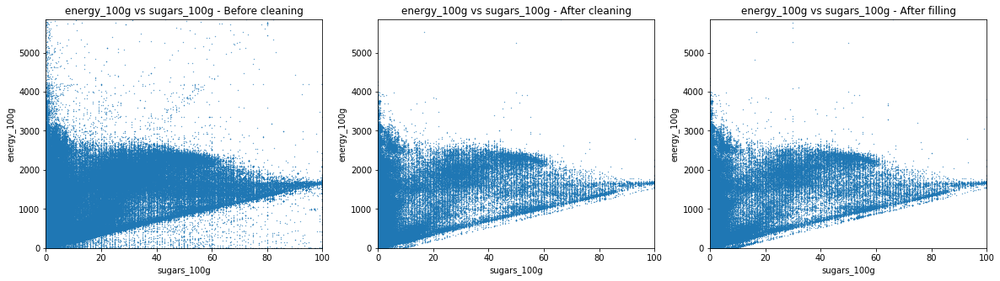

<nav aria-label="Page navigation example">
  <ul class="pagination justify-content-end">
    <li class="page-item disabled">
      <a class="page-link" href="#" tabindex="-1">Previous</a>
    </li>
    <li class="page-item"><a class="page-link" href="#">Cleaning / Filling process</a></li>
    <li class="page-item"><a class="page-link" href="./nutriscore_vis.html">NutriScore visualisation</a></li>
    <li class="page-item disabled">
      <a class="page-link" href=#">Next</a>
    </li>
  </ul>
</nav>
                                                
## Data Visualisation
### Histograms
We will now plot histograms of the data, as well as scatterplots and correlations. As there are numerous different histograms to plot, we serialize this process.

The histogramms of sugar, fat, saturate fat, salt, sodium, fiber and proteins have a very similar aspect. We will see in the following graph if it corresponds to a power law.
    
The energy histogram is a bit more spread in higher values. Both fruits/vegetables/nuts content indices look very destructured, but this is not surprising since most of these values are estimates. Moreover, the threshold used by the Nutri-Score algorithm to attribute a score in function of the fruits/vegetables/nuts content makes a distinction at various thresholds (<40%, >40%, >60% and >80%), which means that one can observe an important threshold effet. Moreover, there is no clear convention about how theses fruit/vegetables/nuts contents have to be made. Still, thanks to these verges, estimation of fruit content do not have to be extremely precise.

One can see that salt and sodium content may represent a power law, caracterised by the straight segment. Fiber and sugar also have somehow a similar aspect. On the contrary, for proteins, fats and saturated fats, one will be able observe a horizontal line at the beginning and a drop in the counts at the end. 

### Correlations

<table border="1" class="dataframe">
  <thead>
    <tr style="text-align: right;">
      <th></th>
      <th>energy_100g</th>
      <th>fat_100g</th>
      <th>saturated-fat_100g</th>
      <th>sugars_100g</th>
      <th>salt_100g</th>
      <th>sodium_100g</th>
      <th>fruits-vegetables-nuts_100g</th>
      <th>fruits-vegetables-nuts-estimate_100g</th>
      <th>fiber_100g</th>
      <th>proteins_100g</th>
    </tr>
  </thead>
  <tbody>
    <tr>
      <th>energy_100g</th>
      <td>1.000000</td>
      <td>0.817869</td>
      <td>0.626831</td>
      <td>0.319871</td>
      <td>-0.023507</td>
      <td>-0.023510</td>
      <td>-0.171717</td>
      <td>-0.245808</td>
      <td>0.229026</td>
      <td>0.271525</td>
    </tr>
    <tr>
      <th>fat_100g</th>
      <td>0.817869</td>
      <td>1.000000</td>
      <td>0.733552</td>
      <td>-0.033292</td>
      <td>-0.003381</td>
      <td>-0.003385</td>
      <td>-0.166035</td>
      <td>-0.200962</td>
      <td>0.065585</td>
      <td>0.169655</td>
    </tr>
    <tr>
      <th>saturated-fat_100g</th>
      <td>0.626831</td>
      <td>0.733552</td>
      <td>1.000000</td>
      <td>0.061045</td>
      <td>-0.006936</td>
      <td>-0.006938</td>
      <td>-0.223890</td>
      <td>-0.239060</td>
      <td>0.027153</td>
      <td>0.168513</td>
    </tr>
    <tr>
      <th>sugars_100g</th>
      <td>0.319871</td>
      <td>-0.033292</td>
      <td>0.061045</td>
      <td>1.000000</td>
      <td>-0.077787</td>
      <td>-0.077780</td>
      <td>0.074202</td>
      <td>0.009511</td>
      <td>0.047744</td>
      <td>-0.194738</td>
    </tr>
    <tr>
      <th>salt_100g</th>
      <td>-0.023507</td>
      <td>-0.003381</td>
      <td>-0.006936</td>
      <td>-0.077787</td>
      <td>1.000000</td>
      <td>0.999999</td>
      <td>-0.101725</td>
      <td>-0.050666</td>
      <td>-0.004311</td>
      <td>0.063660</td>
    </tr>
    <tr>
      <th>sodium_100g</th>
      <td>-0.023510</td>
      <td>-0.003385</td>
      <td>-0.006938</td>
      <td>-0.077780</td>
      <td>0.999999</td>
      <td>1.000000</td>
      <td>-0.101723</td>
      <td>-0.050664</td>
      <td>-0.004314</td>
      <td>0.063649</td>
    </tr>
    <tr>
      <th>fruits-vegetables-nuts_100g</th>
      <td>-0.171717</td>
      <td>-0.166035</td>
      <td>-0.223890</td>
      <td>0.074202</td>
      <td>-0.101725</td>
      <td>-0.101723</td>
      <td>1.000000</td>
      <td>0.999981</td>
      <td>0.134036</td>
      <td>-0.214541</td>
    </tr>
    <tr>
      <th>fruits-vegetables-nuts-estimate_100g</th>
      <td>-0.245808</td>
      <td>-0.200962</td>
      <td>-0.239060</td>
      <td>0.009511</td>
      <td>-0.050666</td>
      <td>-0.050664</td>
      <td>0.999981</td>
      <td>1.000000</td>
      <td>0.144027</td>
      <td>-0.205393</td>
    </tr>
    <tr>
      <th>fiber_100g</th>
      <td>0.229026</td>
      <td>0.065585</td>
      <td>0.027153</td>
      <td>0.047744</td>
      <td>-0.004311</td>
      <td>-0.004314</td>
      <td>0.134036</td>
      <td>0.144027</td>
      <td>1.000000</td>
      <td>0.183465</td>
    </tr>
    <tr>
      <th>proteins_100g</th>
      <td>0.271525</td>
      <td>0.169655</td>
      <td>0.168513</td>
      <td>-0.194738</td>
      <td>0.063660</td>
      <td>0.063649</td>
      <td>-0.214541</td>
      <td>-0.205393</td>
      <td>0.183465</td>
      <td>1.000000</td>
    </tr>
  </tbody>
</table>

There are many interesting correlations. 

The energy is highly correlated to fat and saturated fat, and moderately to sugar, fiber and proteins. This is a coherent correlation as it is those nutrients which are the source of energy.
Saturated fat is highly correlated to fat as the first is a subcategory of the second.
Sodium and salt are perfectly correlated as the salt/sodium ratio is fixed, with a proportion of 2.5.
Both fruits/vegs/nuts contents, real and estimated, are perfectly correlated due to the cleaning. Estimated fruits content has a moderated negative correlation with energy, fat and saturated fat. But it is interesting to notice that both fruits/veg/nuts and sugar contents and are not correlated according to these data even if, in the reality, the fruits/veg/nuts content increases sugars content of a product. 

### Scatter plot

We used these scatter plots in order to obtain new insights about the data and get cues about the cleaning possibilites.

The dirty fat-to-energy plot shows a triangular shape. The lower side has a slope of 37 kJ, which corresponds to the energy density of a gram of fat. The triangular shape comes from a high sparsity among the low fat values. This phenomenon is due to the presence of sugar, proteins and fibers that also contribute to the energy of a product. As the amount of fat increases, it becomes the main source of energy. The cleaning sets a minimum energy amount, based on the other nutrients values, to which a constant is substracted, as an error margin.

The other graphs have similar behaviour. The slopes are 17 for sugar and proteins and 8 for fibers.

One can observe that the most important cleaning of the database occurs before its filling. Indeed, the distribution found in the scatter plot is identical if one compare it to the corresponding scatter plot before the automatic filling process.

The dirty scatter plot indicates that some product have a higher value of saturated fat than the value of total fat, which is of course impossible. As the criterion used in Nutri-Score is the amount of saturated fat, we then set for erroneous product the amount of fat up to the amount of saturated fat. This is a conservative way of cleaning as it tends to penalize products.

The slope of the scatter plot is 2.5 as expected. Most of the data is clean, changes are minor.

This displays mostly the completion during the cleaning part.

