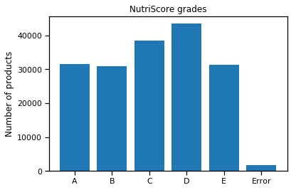
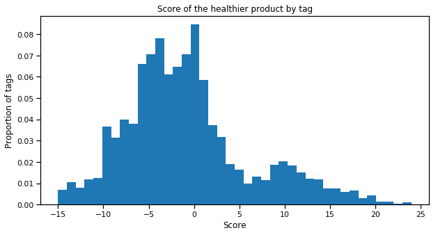

# Algorithm
We have created several algorithms that take place at different times in the application. These are the calculation of the NutriScore, the creation of nutrient recommendations and the proposal of a healthier product for users.

## NutriScore
This algorithm evolved during the project. The first version, based on the document from the French Ministry of Agriculture, was developed to calculate a single product. We have managed to have a good percentage of success as you can see on the page: Data visualization. 

This algorithm takes into account different aspects of the food. First, it determines whether or not it is a drink. Indeed, the regulations are not the same between these two categories. For beverages, for example, only pure water can have an A grade. In general, we calculate the difference in points between negative and positive points to determine the grade of the food. 

On the positive side, they are determined by the content of fruit, fibre and protein for solid foods while for beverages, only fruit will lower the product's score. Only energy and sugars are considered as negative points for both types of food. In addition, we consider lipids and sodium as negative for solid foods.

For our application, we needed to think differently. Indeed, we don't stupidly want to give a NutriScore per food to the user but a general NutriScore. To do this we created a treatment of the products before the final calculation made by our first algorithm. 
To do this, we will retrieve the selected products from the database but also, if the user has eaten raw products, we collect the nutritional values of the product using the API of American agriculture. On the basis of the quantities indicated by the user, we calculate the proportions of each product and standardize to 100g in a general product. Throughout this process, it was necessary to manage the exceptions defined by the NutriScore rules for each product before creating a single product.

## Recommendations
On the basis of the quantities of nutritional values provided by the previous algorithm and the daily recommendations defined by the Swiss Society of Nutrition (SSN), we can indicate to our users where they stand in their nutrition.  We can therefore indicate to him the weaknesses and advantages of his diet, which allows him to make clear choices to improve it. 

## Healthier products
Finally, to improve the nutrition of our user, we have developed an algorithm to offer products with a better score than the one eaten. 
To do this, we calculated the score and grade of each product contained in the database.

We can see that the error rate is low. This is due to our data completion algorithm. We also observe that this is an almost uniform distribution.

Based on this data, our algorithm for searching for healthier products is based on one of the most specific tags of the product selected by the user. It then searches for products that have the same tag and looks at their respective scores. Our algorithm will then find the product with the lowest score. If it does not find, the selected product is considered as the healthiest product in its category. 

To give you an idea, we have calculated for all tags used more than 10 times in the database the minimum score.

We also calculated the difference between the score of each product and the minimum score for its category. 

To give an even better idea of the distribution of scores by tags, we have also calculated the maximum score. We then represent this graph as a scatter plot where the darker the point, the more tags are located at that point. 

With these three graphs, we see that the minimum scores are distributed everywhere. The healthiest products do not necessarily have a good grade. Of course, we can give a reason for this. This may be a class of products to avoid initially, such as mayonnaise, for example. We also observe that the differences between products are also large, the worst being a difference of 51. This great difference is also observed in the last graph as being located at the top left. This is actually one of the largest tags whose almost all products in the database contain this tag. This great difference is then a simple artifact in itself because it can be considered as the maximum difference between all products.

To come back to the second graph, the peak in 0 is interesting because it represents the healthiest products. Indeed, about 2.5% of products in our database are the healthiest products. We can also observe that a majority of products have a difference of 10. This is confirmed by the last graph where there is a preponderance of tags that have a minimum around 0 and a maximum around 10. We find through the right histogram on this same graph that the maximums are also widely distributed in Gaussian as is the case for the minimums. 
