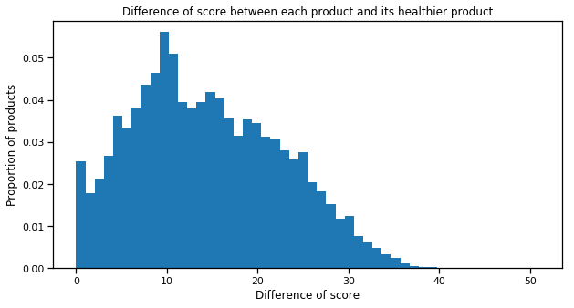
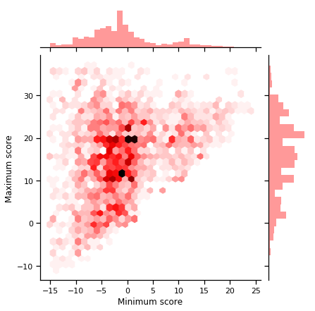

# Algorithm
We have created several algorithms that take place at different time in the software. There implementation helps to achieve the computation of the NutriScore, the creation of nutrient recommendations and the proposal of a healthier product for users.

## NutriScore
This algorithm evolved during the project. The first version, based on the document from the french Ministry of Agriculture, was developed to compute the NutriScore of a single product. The precision of this first version was satisfying, in comparison with the actual NutriScore of the database, as it is explained in the ''Data visualization'' page. 

This algorithm takes into account different aspects of the food. First, it determines whether or not it is a drink. Indeed, the computation rules are not the same between solid and liquid products. For beverages, for example, only pure water can get the grade A. In general, we have to take into account both positive (e.g high fruits/veg/nuts content) and negative points (e.g high amount of sugar) to determine the final grade of a product.

To get a bit deeper into these aspects, concerning solid foods, the positive points are determined by the content of fruits/vegs/nuts, fibre and protein. For beverages, only fruits/vegs/nuts content will lower the product's score. Energy and sugars amounts are considered to have a negative impact for both types of food. In addition, lipids and sodium are considered to be a negative influence regarding solid foods.

In our software design, we needed to think at a more global scope. Indeed, we wanted to deliver a global NutriScore to the user instead of a classic per-aliment NutriScore. To do that, the data and the product were handled in a specific way before being computed by the NutriScore algorithm. The first step is done at the individual level, it consists in retrieving the selected products form the database, consistently with the user instructions. The database being sometimes scarse with regard to raw products, the nutritional values of this kind of product are queried using the API of the US Department of Agriculture. On the basis of the quantities indicated by the user, the proportions of each product are computed and normalized to 100g, in a sort of global product. This normalization to 100g will indeed  allow the use of the NutriScore algorithm. Throughout this process, the various exceptions defined by the NutriScore rules concerning each product were also taken into account.

## Recommendations
On the basis of the quantities of nutritional values provided by the previous algorithm and the daily recommendations defined by the Swiss Society of Nutrition (SSN), one can indicate to users where they stand in their nutrition. The main weaknesses and advantages of the user's diet can be clearly outlined and this information can provide interesting insights to the user about how to improve his diet. The neutral and factual result delivered to him also tries to avoid taking a moralizing tone, which can often be counter-productive.

## Healthier products
Finally, to improve the diet of our user, an algorithm was developped in order to offer products with a better score than the ones actually consumed. To this extend, the score and grade of each product contained in the database were computed beforehand. This results in a very small pressure on the memory (only 30 Mb) but in great improvement in terms of computation time, which is a good compromise and allows a higher reactivity.

One can see that the error rate is low. This is due to the preprocessing, which includes a data completion algorithm. The latter quite successfully helps to fill missing information. One can also notice that the distribution is nearly uniform.

Based on this data, our algorithm is searching for healthier products, as alternatives to propose to the user. The idea is to allow the user to eat healthier products without imposing foods that he/she do not like. For example, if the user likes to eat cookies, we will not adopt a moralizing tone and advise him to eat fewer cookies. Instead, we're going to offer him another kind of cookie, much healthier. This strategy would in our opinion be much more productive because it adapts to the person's habits, rather than trying to change their eating habits. And as we will see, you can eat much better while eating the same type of food.

The algorithm which provides this recommandation is based on one of the most specific tags of the product selected by the user. It then searches all products that have the same tag and looks at their respective scores. The algorithm will then select the product with the better NutriScore and returns it. If it does not find any similar product with a better NutriScore, the selected product is considered as the healthiest product in its category. 

To give you an idea, we have calculated the minimum score (= the better score) for all tags that are used more than 10 times in the database

We also calculated the difference between the score of each product and the minimum score (= the better score) for its category. One can observe that significant improvement can be brought to one's diet while continuing to eat the same kind of products.

To give an even better idea of the distribution of scores by tags, we also plotted the relation between maximal (= worst) and minimal (= best) scores in a single same category. This is then represented in this graph as a density-discernible scatter plot where the darker the point, the more tags are located at that point. 

In these three graphs, one can see that the minimum scores are distributed everywhere. The healthiest products do not necessarily have a good grade. Of course, one can give a reason for this. This may be a class of products to avoid initially, such as mayonnaise, for example. Nevertheless, we will try to propose the best of these "bad products" to the user, and that is already a big improvement in some cases. One can also observe that the differences between products can be very large. In one case, we notice a significant difference of 51 in score. This huge difference can be observed at the top left of the last plot. This is actually one of the largest tags. As almost all products in the database contain this tag, this great difference can then be considered as a simple artifact in itself because it represents the maximum difference between all products.

To come back to the second plot, the peak found in 0 is especially interesting as it represents the healthiest products. Indeed, about 2.5% of products in our database are obtain the best possible score. One can also observe that a majority of products have a difference of 10. This is confirmed in the last graph where there is a preponderance of tags that have a minimum around 0 and a maximum around 10. We find through the right histogram on this same plot, as the maxima are also widely distributed in Gaussian-like distribution, and so are the minima.

