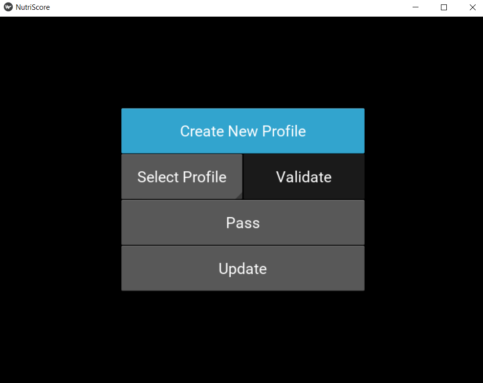
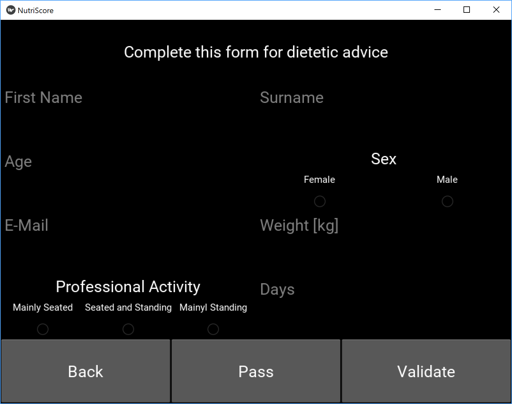

# Application

## Download

Select your operating system to download  the compatible application :

* [Windows](https://www.youtube.com/watch?v=dQw4w9WgXcQ)
* [OSX](https://www.youtube.com/watch?v=y6120QOlsfU)
* [Android](https://www.youtube.com/watch?v=L_jWHffIx5E)
* [iOS](https://www.youtube.com/watch?v=rvrZJ5C_Nwg)

## How to ?

### 1. Home Screen

This is simply the home screen of the application. Nothing special here, click on the screen to continue to the following page.

### 2. Profile Screen

This is the main profile screen. You have now several options :

1. Create New Profile

Pressing the **Create New Profile** button will let you complete a settings form in order to store the information needed for the recommendation e-mail.

**_Note !_** All your personal information is stored locally in the file `AppFolder/data/profile.csv`. Every piece of information can be modified directly by end. *Be careful not to corrupt data.* **No information is collected by NutriTeam as everything is dealt with locally.**

2. Select profile

Pressing the **Select Profile** button will let you choose between already existing profiles. You will later be able to modify this profile if there is any error in the form. If no profile was created before, this list will be empty and you should instead create a new profile.

Once you selected the appropriate profile, you can press the **Validate** button which is now activated.

3. Pass

If you choose not to create a profile, you can press the **Pass** button which will bring you directly to the [Product Screen](###-4.-product-screen). However, you will only get the NutriScore grade and not receive any other recommendations.

4. Update

As the database of *OpenFoodFacts* grows and improves daily, you might want to update the local database frequently, which can be done pressing this button.

### 3. Settings Screen

The Settings Screen is an optional screen. You can input your personal information in order to complete your profile. A complete profile will enable the recommendation e-mail.
The profile need the following information :
1. **Name** : Enter your name (It can be a pseudo, as it is used to distinguish the profiles and personalize the e-mail.)
2. **Surname** : Enter your surname (It can be a pseudo, as it is used to distinguish the profiles and personalize the e-mail.)
3. **Age** : Enter your age, in years. It must be a whole number between 1 and 120. It is used for the computation of the recommendations.
4. **Sex** : Check either Male or Female. It is a binary choice, unrelated to the gender, as nutrition tables take the sexual dimorphism of metabolism as a criterion.
5. **Weight** : Enter your weight, in kilograms. It must be a positive whole number. It is used for the computation of the recommendations.
6. **Email** : Enter your e-mail in order to receive an message from us with your recommendations inside.
7. **Activity** : Check the radio button which describes the most your job, i.e. mainly seated, seated and standing or mainly standing. It is used for the computation of the recommendations.
8. **Days** : Enter the number of days over which you want to evaluate your food consumption. It must be a positive whole number.

If input data do not correspond to the criteria, the fields concerned will be reset and displayed in red.

Here is an example of a completed profile :

Once again, it is possible to pass the profile, by pressing the **Pass** button. You will then not have any recommendation e-mail.

You can also go back to the [Profile Screen](###-2.-profile-screen) by pressing on the **Back** button

### 4. Product Screen
