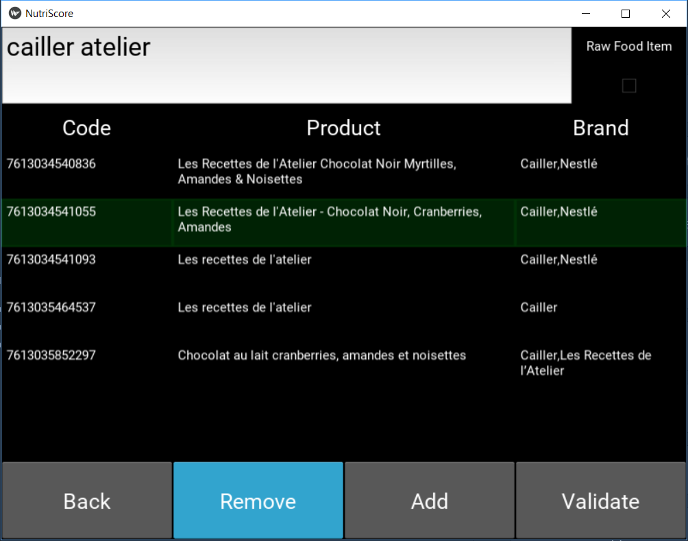

# Application

## Download

Select your operating system to download  the compatible application :

* <a href="https://www.youtube.com/watch?v=dQw4w9WgXcQ" target="_blanck">Windows</a>  Available
* <a href="https://www.youtube.com/watch?v=Um7pMggPnug" target="_blanck">Linux</a>  Not Available
* <a href="https://www.youtube.com/watch?v=y6120QOlsfU" target="_blanck">OSX</a>  Not Available
* <a href="https://www.youtube.com/watch?v=L_jWHffIx5E" target="_blanck">Android</a>  Not Available
* <a href="https://www.youtube.com/watch?v=rvrZJ5C_Nwg" target="_blanck">iOS</a>  Not Available

## How to ?

### 1. Home Screen

This is simply the home screen of the application. Nothing special here, click on the screen to continue to the following page.

### 2. Profile Screen

This is the main profile screen. You have now several options :

#### 1. Create New Profile

Pressing the **Create New Profile** button will let you complete a settings form in order to store the information needed for the recommendation e-mail.

**_Note !_** All your personal information is stored locally in the file `AppFolder/data/profile.csv`. Every piece of information can be modified directly by end. *Be careful not to corrupt data.* **No information is collected by NutriTeam as everything is dealt with locally.**

#### 2. Select profile

Pressing the **Select Profile** button will let you choose between already existing profiles. You will later be able to modify this profile if there is any error in the form. If no profile was created before, this list will be empty and you should instead create a new profile.

Once you selected the appropriate profile, you can press the **Validate** button which is now activated.

#### 3. Pass

If you choose not to create a profile, you can press the **Pass** button which will bring you directly to the [Product Screen](#ProductScreen). However, you will only get the NutriScore grade and not receive any other recommendations.

#### 4. Update

As the database of *OpenFoodFacts* grows and improves daily, you might want to update the local database frequently, which can be done pressing this button.

### 3. Settings Screen

The Settings Screen is an optional screen. You can input your personal information in order to complete your profile. A complete profile will enable the recommendation e-mail.
The profile need the following information :
1. **Name** : Enter your name (It can be a pseudo, as it is used to distinguish the profiles and personalize the e-mail.)
2. **Surname** : Enter your surname (It can be a pseudo, as it is used to distinguish the profiles and personalize the e-mail.)
3. **Age** : Enter your age, in years. It must be a whole number between 1 and 120. It is used for the computation of the recommendations.
4. **Sex** : Check either Male or Female. It is a binary choice, unrelated to the gender, as nutrition tables take the sexual dimorphism of metabolism as a criterion.
5. **Weight** : Enter your weight, in kilograms. It must be a positive whole number. It is used for the computation of the recommendations.
6. **Email** : Enter your e-mail in order to receive an message from us with your recommendations inside.
7. **Activity** : Check the radio button which describes the most your job, i.e. mainly seated, seated and standing or mainly standing. It is used for the computation of the recommendations.
8. **Days** : Enter the number of days over which you want to evaluate your food consumption. It must be a positive whole number.

If input data do not correspond to the criteria, the fields concerned will be reset and displayed in red.

Here is an example of a completed profile :

Once again, it is possible to pass the profile, by pressing the **Pass** button. You will then not have any recommendation e-mail.

You can also go back to the [Profile Screen](###-2.-profile-screen) by pressing on the **Back** button

<h3 id="ProductScreen">4. Product Screen</h3>

This is the most crucial screen of the application. Therefore, it is also the one most needs further improvements in both our algorithm and the *OpenFoodFacts* database.

The point of the screen is to select the different foods that make up the diet you want to analyse. There are several ways of searching an item, according to its nature, i.e *industrial, processed food* or *raw food*.

#### 1. Industrial Processed Food

Those are the products found in the database of *OpenFoodFacts*. These products have a **barcode**, a **product name** and a **brand**. It is possible to search for these different parameters in two ways : either with the barcode (partial or complete), either with keywords present in the product name and the brand.

Searching with keywords can be very troublesome. Indeed, some products have many kinds of variations in shape, size, volume, design and so on. That is especially true for beverages as it exists for the same kind of product many different type of bottles (250ml, 330ml, 0.75l, 1l, 1.5l, 2l, 1 gallon, ...) and often limited editions. The problem is that they will all have the same name in the *OpenFoodFacts* database, but different barcodes. As the nutritional values are scaled to 100g or 100ml, products of different sizes should be the same, but it tends to jeopardize the quality of the database as it is prone to errors.

Example of trouble :

For all this reasons, NutriTeam advise you to search your product using the **barcode**. It is not necessary to input the whole code, a subset of it is sufficient. This way seems more efficient to find the right product.

Example :

In case no product matches your query, a warning message is displayed.

#### 2. Raw Food

A large part of the food we buy does not belong to a brand. That is what we call *raw food*. For example, fruits, vegetables, unprocessed meat or fish fall into this category. All those products are not included in the *OpenFoodFacts* database. Therefore, we provide another way to get the nutritional values, base on an API.

In order to add this kind of product, you have to activate the checkbox **Raw Food**, then write the product name and press enter. Only one product will displayed.

Once you found the desired product, click on it. The product should now appear highlighted in green.

**_Note !_** The list of product can be quite long, you might have to scroll down.

Once you selected the desired product, press the **Add** button or the **Remove** button if you made a mistake. In case you made a mistake without realizing it, it can still be dealt with later, so do not worry !

You can then search the next product.

**_Bug report_** When you search for another product, the green highlight will remain on the screen. However, the product under the highlight is not considered selected. You still have to press the desired product, else no product will be added or removed.

Once you added all the products that make up your diet you can press the **Validate** button.

### 5. Quantities Screen

### 6. Final Screen

### 7. E-mail

## Demo
