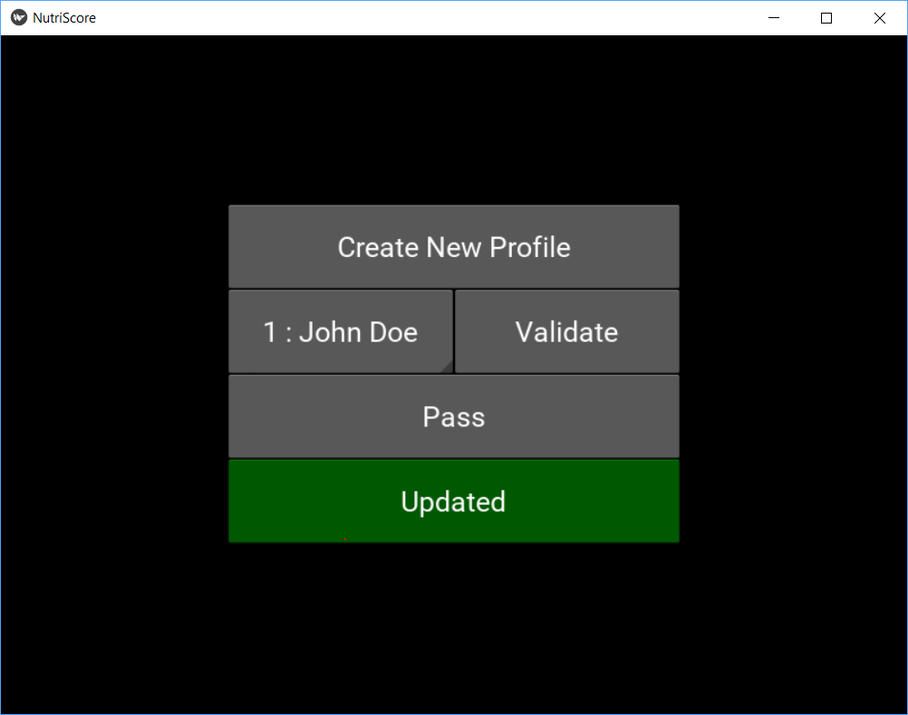
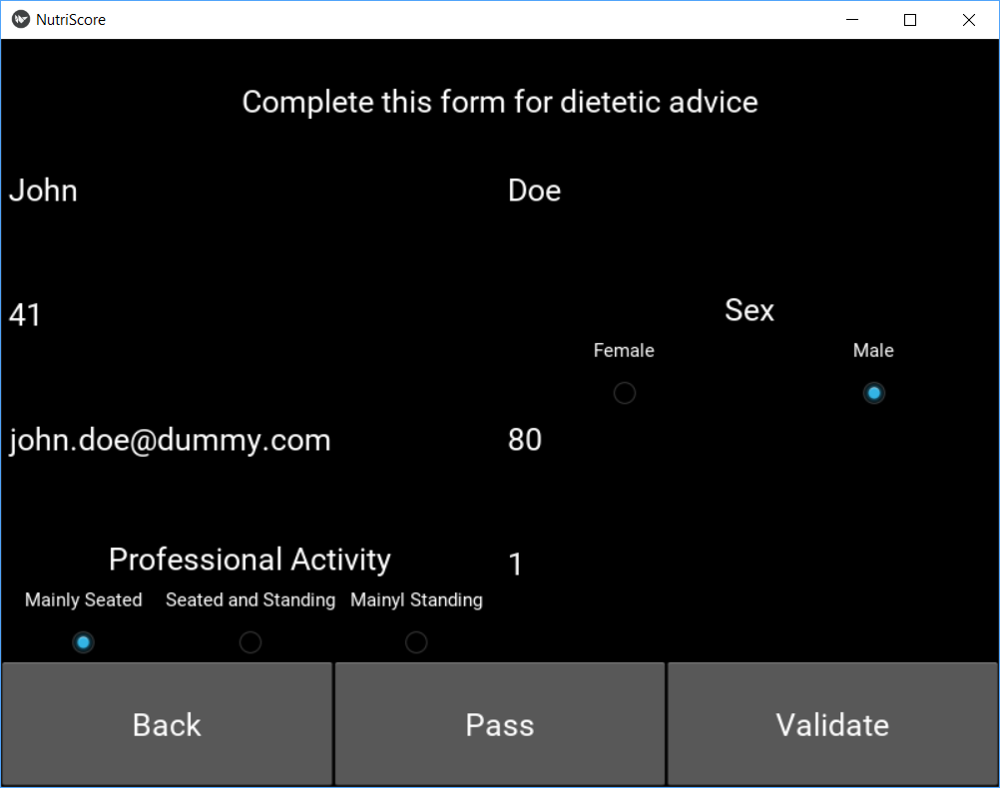
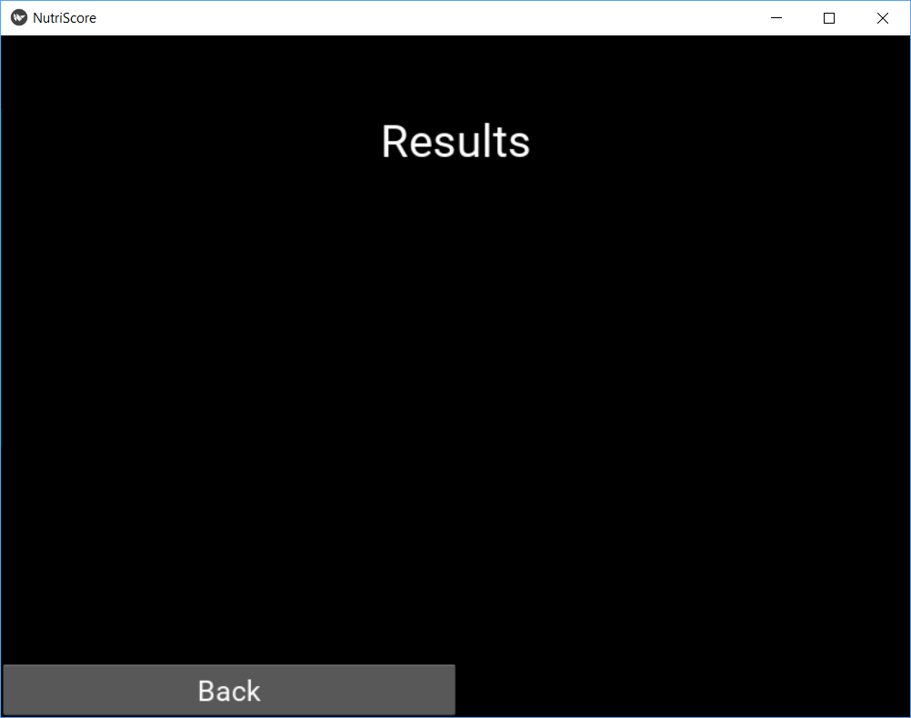
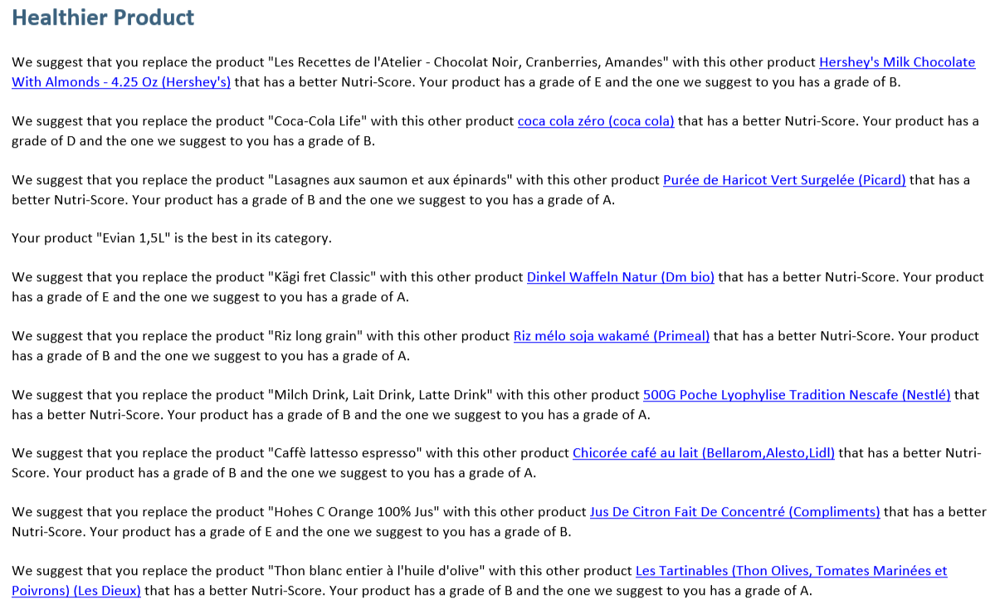

<nav aria-label="Page navigation example">
  <ul class="pagination justify-content-end">
    <li class="page-item disabled">
      <a class="page-link" href="#" tabindex="-1">Previous</a>
    </li>
    <li class="page-item"><a class="page-link" href="#">User guide</a></li>
    <li class="page-item"><a class="page-link" href="./case_study.html">Storytelling</a></li>
    <li class="page-item">
      <a class="page-link" href="./case_study.html">Next</a>
    </li>
  </ul>
</nav>

# Application

* [Download](#download)
* [How to ?](#how_to_)
  1. [Home Screen](#1-home-screen)
  2. [Profile Screen](#2-profile-screen)
  3. [Settings Screen](#3-settings-screen)
  4. [Product Screen](#4-product-screen)
  5. [Quantities Screen](#5-quantities-screen)
  6. [Final Screen](#6-final-screen)
  7. [E-mail](#7-e-mail)
* [Demo](#demo)

## Download

Select the compatible application according to your operating system :

* <a href="https://drive.google.com/uc?export=download&id=1GDDy9TQdLZJNLAZzpTE9X7SElZ3zKvsT" download>Windows</a>  Available
* <a href="./404.html" target="_blanck">Linux</a>  Not Available
* <a href="./404.html" target="_blanck">OSX</a>  Not Available
* <a href="./404.html" target="_blanck">Android</a>  Not Available
* <a href="./404.html" target="_blanck">iOS</a>  Not Available

## How to ?

### 1. Home Screen

This is simply the home screen of the application. Nothing special here, click on the screen to continue to the following page.

### 2. Profile Screen

This is the main profile screen. There is now several options :

#### 1. Create New Profile

Pressing the **Create New Profile** button will create a new settings form to complete in order to store the information needed for the recommendation e-mail.

**_Note !_** All personal information is stored locally in the file `AppFolder/data/profile.csv`. Each piece of information can be modified directly by hand. *Be careful not to corrupt the data.* **No information is collected by NutriTeam as everything is dealt with locally.**

#### 2. Select profile

Press the **Select Profile** button to choose between several existing profiles. It will be possible to modify this profile later if there is any error in the form. If no profile was created before, this list is empty and the only options are to create a new profile or pass.

Once the appropriate profile has been selected, press the **Validate** button which is now activated.

#### 3. Pass

It is possible to use the application without profile by pressing the **Pass** button which will bring directly to the [Product Screen](#4-product-screen). However, only the NutriScore grades will be computed and no other recommendations by e-mail.

#### 4. Update

As the database of *OpenFoodFacts* grows and improves daily, it is great to update the local database frequently, which can be done pressing this button. The button turns blue when it is updating. *Wait, do not press other buttons to avoid crashing the application !* Then, it turns green when the update is finished. Our team will update the database once per month.

### 3. Settings Screen

The Settings Screen is an optional screen to enter personal information in order to complete a profile. A complete profile will enable the recommendation e-mail.
The profile need the following information :
1. **Name** : Enter your name (It can be a pseudo, as it is used to distinguish the profiles and personalize the e-mail.)
2. **Surname** : Enter your surname (It can be a pseudo, as it is used to distinguish the profiles and personalize the e-mail.)
3. **Age** : Enter your age, in years. It must be an integer between 1 and 120. It is used for the computation of the recommendations.
4. **Sex** : Check either Male or Female. It is a binary choice, unrelated to the gender, as nutrition tables take the sexual dimorphism of metabolism as a criterion.
5. **Weight** : Enter your weight, in kilograms. It must be a positive integer. It is used for the computation of the recommendations.
6. **Email** : Enter your e-mail in order to receive a message from us with your recommendations inside.
7. **Activity** : Check the radio button which describes the most your job, i.e. mainly seated, seated and standing or mainly standing. It is used for the computation of the recommendations.
8. **Days** : Enter the number of days over which you want to evaluate your food consumption. It must be a positive integer.

If input data do not correspond to the criteria, the fields concerned will be reset and displayed in red.

Here is an example of a completed profile :

Once again, it is possible to pass the profile, by pressing the **Pass** button. But no recommendation e-mail will be send out.

It is also possible to go back to the [Profile Screen](#2-profile-screen) by pressing on the **Back** button

## 4. Product Screen

This is the most crucial screen of the application. Therefore, it is also the one most in need of further improvements in both our algorithm and the *OpenFoodFacts* database.

The point of the screen is to select the different foods that make up the diet you want to analyse. There are several ways of searching an item, according to its nature, i.e *industrial, processed food* or *raw food*.

#### 1. Industrial Processed Food

Those are the products found in the database of *OpenFoodFacts*. These products have a **barcode**, a **product name** and a **brand**. It is possible to search for these different parameters in two ways : either with the barcode (partial or complete), either with keywords present in the product name and the brand.

Searching with keywords can be very troublesome. Indeed, some products have many kinds of variations in shape, size, volume, design and so on. That is especially true for beverages as it exists for the same kind of product many different type of bottles (250ml, 330ml, 0.75l, 1l, 1.5l, 2l, 1 gallon, ...) and often limited editions. The problem is that they will all have the same name in the *OpenFoodFacts* database, but different barcodes. As the nutritional values are scaled to 100g or 100ml, products of different sizes should be the same, but it tends to jeopardize the quality of the database as it is prone to errors.

Example of trouble :

For all this reasons, NutriTeam's advice is to search a product using the **barcode**. It is not necessary to input the whole code, a subset of it is enough. This way seems more efficient to find the right product.

Example :

In case no product matches a query, a warning message is displayed. The lack of matching may be due to different causes : maybe a spelling mistake or the product is not in the OpenFoodFacts database. Or our completion and cleaning algorithm has removed the product because either too much information is missing in the OpenFoodFacts database or the product does not contain any tags in the database. Check on OpenFoodFacts if the product exists and if it is complete according to our criteria. If this is not the case, we encourage everyone to modify the product in question so that we can process it properly and everyone can find this product in the near future.

#### 2. Raw Food

A large part of the food we buy does not belong to a brand. That is what we call *raw food*. For example, fruits, vegetables, unprocessed meat or fish fall into this category. All those products are not included in the *OpenFoodFacts* database. Therefore, we provide another way to get the nutritional values, base on an API from US Department of Agriculture.

In order to add this kind of product, it is required to activate the checkbox **Raw Food**, then write the product name and press enter. Only one product will displayed.

Once the desired product is found, click on it. The product should now appear highlighted in green.

**_Note !_** The list of product can be quite long, you might have to scroll up or down.

Once the desired product is selected, press the **Add** button or the **Remove** button if it was a mistake. In case a mistake has been done without realizing it, it can still be dealt with later, so do no worries !

It is now possible to search other products.

**_Bug report_** When searching for another product, the green highlight will remain on the screen. However, the product under the highlight is not considered selected. It is still required to press the desired product, else no product will be added or removed. This bug cannot be solved, as the clear method is still on the <a href="https://kivy.org/doc/stable/api-kivy.uix.recycleview.html?highlight=recycleview#module-kivy.uix.recycleview" target="_blanck">TO DO list of Kivy</a>.

Once all the products that make up the user diet have been selected, press the **Validate** button.

### 5. Quantities Screen

This screen is dedicated to the entry of quantities consumed by products. Each value has to be input individually, as a positive integer in grams or mililiters, according if it is solid food or beverages. If by mistake there is one or more unwanted products, it is possible to leave the quantity at 0 instead of returning to the [Product Screen](#4-product-screen) to remove it. In order to save a quantity, it is necessary to press the **Add** button of each product.

**_Bug report_** There is a display bug with the **Add** button. The *on_press* animation happens on another button of the list, for unknown reasons. However, it is indeed the button pressed which will save the quantity value of its corresponding product.

Example of filled in quantities :

When all desired quantities are entered, press the **Validate** button.

### 6. Final Screen

This is the final screen of this application. While the screen looks like the image above, the application is computing the Nutri-Scores. *Wait, do not press other buttons to avoid crashing the application !*

Finally, the results will be displayed as in the image below.

### 7. E-mail

If a profile was selected, an e-mail has been sent out to the email address. Check the spam folder if necessary.

The E-mail is organized in several categories.

#### 1. Nutri-Score

This is a reminder of the Nutri-Scores.

#### 2. Recommendation

This is recommendations according to the diet. The reference values come from <a href="http://www.sge-ssn.ch/fr/science-et-recherche/denrees-alimentaires-et-nutriments/recommandations-nutritionnelles/valeurs-de-reference-dach/" target="_blanck"
	>Société Suisse de Nutrition (SSN)</a>. These recommendations are not for medical use and have been computed from <a href="https://world.openfoodfacts.org/" target="_blanck">	Open Food Facts</a> database.

#### 3. Healthier product

These are recommendations concerning the choice of products. According to its category, it is determined if a product is the best one or if there is a better product. If so, this better product is suggested.

#### 4. Selected products

This is a reminder of the products selected. They are linked to their page on *OpenFoodFacts*. It is strongly encouraged to look at these pages and correct/complete them if mistakes are found. That will improve *OpenFoodFacts* database, and therefore, this application.

## Demo

<iframe width="420" height="315"
src="https://www.youtube.com/embed/D9rFCgZa9zs?controls=1">
</iframe>

