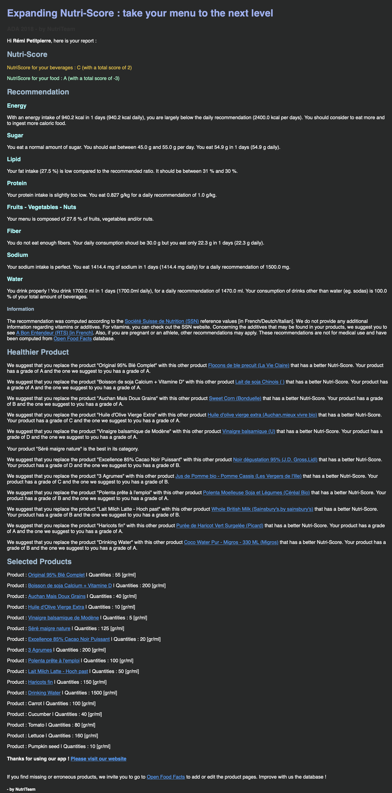

<nav aria-label="Page navigation example">
  <ul class="pagination justify-content-end">
    <li class="page-item">
      <a class="page-link" href="./app.html">Previous</a>
    </li>
    <li class="page-item"><a class="page-link" href="./app.html">User guide</a></li>
    <li class="page-item"><a class="page-link" href="#">Storytelling</a></li>
    <li class="page-item disabled">
      <a class="page-link" href="#" tabindex="-1">Next</a>
    </li>
  </ul>
</nav>

# Storytelling

## Abstract

This Thursday, Rémi started the day with a bowl of cereals, whole wheat biscuits that he sprinkled with soy milk. He also drinks a glass of citrus juice. After this quick breakfast, he takes the bus to school. He sits all day long, relatively static. At noon, he heads to his favourite cafeteria and eats a salad of various raw vegetables and drizzles them with a little sauce. When he returns home at the end of the day, he gives in to the temptation of chocolate and eats a few squares. The evening meal will be made up of polenta accompanied by a recipe of beans, carrots and tomatoes. Before going to bed, he will still eat a plain yogurt.

## Profile summary
In the evening, Rémi decided to calculate his NutriScore using the application he had downloaded from <a href="./app.html#download" >here</a>. It starts by entering the information that the application requires.

Age: 23

Sex: Male

Weight: 54 kg

Activity: low

## Diet summary
Then he summarizes what he ate during the day and enters the food one after the other into the database.

  

    | Breakfast|Quantity
    | ------|-----|
    |Cereals|55
    |Soy milk|200
    |Citrus juice|200
  

  

    |Lunch|Quantity
    | ------|-----|
    |Lettuce|160
    |Tomato|40
    |Cucumber|40
    |Canned corn|40
    |Carrot|40
    |Pumpkin seed|10
    |Olive oil|10
    |Vinegar|5
  

  

    |Evening|Quantity
    | ------|-----|
    |Polenta|100
    |Milk|50
    |Carrot|60
    |Beans|150
    |Tomato|40
    |Yoghurt|125
    |Chocolate|20
  

  

    |Other beverages|Quantity
    | ------|-----|
    |Water|1500
  

## Results
After waiting a few seconds, he receives an email giving him the results of his test.

## Conclusion
During the addition of food to the application, Rémi realized that he sometimes did not find the exact product according to the bar code. After checking on OpenFoodFacts, he realized that these products did not have any tags. It will then take a few minutes a day to complete the OpenFoodFacts database so that next time, the use of the application will be easier.

Noting that he probably didn't eat enough today, Rémi will look for something to complement his intake. He also notes the recommended products he will try to find at the supermarket next time. Thanks to the application, Rémi has been able to partially rebalance his diet and keeps in mind the points on which he can improve.

