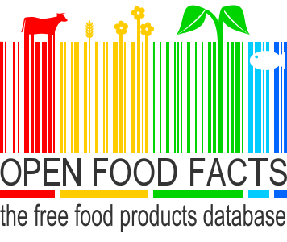

# Open Food Facts Database 

We will mainly use the <a href="https://world.openfoodfacts.org/">Open Food Facts</a> database, which is a collaborative open-access database. Users can contribute by taking a picture of any food product, the list of nutrients and thus provide useful information. The database contains more than 708’000 products at this day and this number is growing rapidly.

This collaborative database system makes it possible to quickly gather a huge amount of information. However, this also has other advantages. User entries can be incorrect, inaccurate or simply incomplete. Therefore, the database is far from being complete. Many products do not have full information because the user may not take a picture of the list of ingredients or sometimes also because the information for a particular product is missing on the packing (not public, differents laws, etc.). The <a href="https://world.openfoodfacts.org/terms-of-use#re-use" target="_blanck">OpenFoodFacts terms of use </a>clearly state that the database may contain errors. As a consequence, the data provided can only be used for informative information and not for medical purpose.

## Content of the database
We decided to focus on only part of the information available in the database. We will use :

* `code` : Barcode of the product
* `product_name` : Name of the product 
* `categories_tags` : Tags that describe the product into categories
* `brands` : Brand of the product
* `energy_100g` : Amount of energy in the product [kJ] per 100g/100ml
* `fat_100g` : Amount of fats in the product [g] per 100g/100ml
* `saturated-fat_100g` : Amount of subacategories of fats (saturated-fat) in the product [g] per 100g/100ml
* `sugars_100g` : Amount of sugars in the product [g] per 100g/100ml
* `salt_100g` : Amount of salt in the product [g] per 100g/100ml
* `sodium_100g` : Amount of subcategories of salt (sodium) in the product [g] per 100g/100ml
* `fruits-vegetables-nuts_100g` : Ratio of Fruits/Vegetables/Nuts really inside the product [%] per 100g/100ml
* `fruits-vegetables-nuts-estimate_100g` : Ratio of Fruits/Vegetables/Nuts estimated inside the product [%] per 100g/100ml
* `fiber_100g` : Amount of fiber in the product [g] per 100g/100ml
* `proteins_100g` : Amount of protein in the product [g] per 100g/100ml
* `nutrition_grade_fr` : Grade of the product (provided by OpenFoodFacts)
* `nutrition-score-fr_100g` : Score of the product (provided by OpenFoodFacts)

## Detection of errors
On this basis of information, we found several errors. 

Some values were negative which is inconsistent with nutritional values. Then, for energy, we decided to consider as an error the products with more than 4'000 kJ. Indeed, 99% of the data is below this value and then there is a significant jump to the maximum. The salt to sodium ratio of 2.5 is also not respected. As well as the fact that saturated fats cannot be higher than the total original fat. We also calculated theoretical energy based on fat, carbohydrates, protein and fibre to detect and correct these inconsistencies. You can see these detections in the section: <a href="./Milestone_2.html">Data visualization</a> of our data story.

## Filling
This error correction has already allowed us to pre-fill the database. But there was still a need to improve the missing data. So we built an algorithm based on the product tags.

Indeed, we look with the tags of the product to be completed, from the least abundant (and therefore supposed to be the most specific) to the most abundant, at the products in the rest of the database that shares the same tag. On the basis of similar products, we calculate the median for each nutritional value.  With these values, we can complete the product if it had a missing value. We have had several versions of this algorithm, but the one used today is independent of the filling. Indeed, we calculate the medians before filling in the missing values for all products. This has also led to a reduction in the complexity of the algorithm. 
