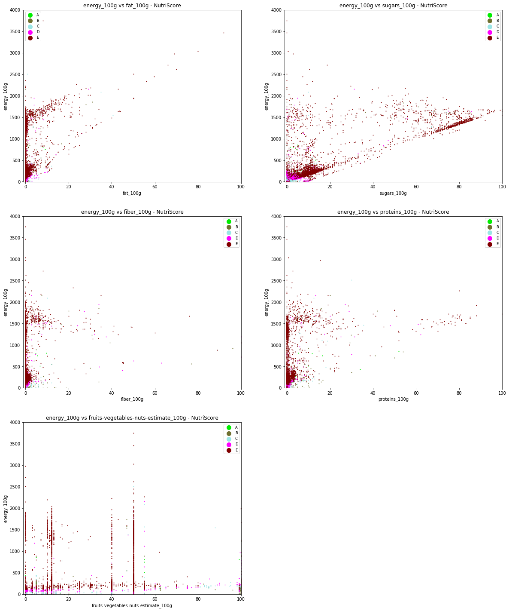

<nav aria-label="Page navigation example">
  <ul class="pagination justify-content-end">
    <li class="page-item">
      <a class="page-link" href="./Milestone_2.html">Previous</a>
    </li>
    <li class="page-item"><a class="page-link" href="./Milestone_2.html">Cleaning / Filling process</a></li>
    <li class="page-item"><a class="page-link" href="#">NutriScore visualisation</a></li>
    <li class="page-item disabled">
      <a class="page-link" href="#" tabindex="-1">Next</a>
    </li>
  </ul>
</nav>

## NutriScore visualisation

#### Beverages products analysis

Here, one can see the scatter plot for product that will be considered as beverages by the NutriScore algorithm. One can observe that most of beverages have low-level of fats but are more sparse concerning sugars and proteins. One can see that the product graded E (worst grade) have the largest value in terms of energy, sugars and proteins and frequently contain less than 50% of fruits/vegetables/nuts. The differences between the other grades (A, B, C & D) are less noticeable. If we had to separate them using machine learning techniques, it would have been difficult. This is why we preferred to directly develop a calculation algorithm based on the official Nutri-Score computation rules.

#### Non-beverages products analysis

One can observe that the products graded C/D/E have very similar properties. They show a large scale of values for what concerns fats and sugars. But one should note, looking at the fruits/veg/nuts content vs energy plot, that it is possible to differentiate the grades according to their energy content, as one can observe several layers. Grade A have a larger amount of fiber, which seems to make sense, as fiber give negative points for the Nutri-Score (NB : the lower the NutriScore, the better the grade).

### NutriScore - Computation

As stated above, we developped our NutriScore computation algorithm using the exact criteria specified in the official documents from the french Ministry of Agriculture. As the products effective grade are indicated in the database, we can quantify the accuracy of the algorithm and try to increase its efficiency.

In general, except for exceptions, the score is computed in this manner :  
ScoreBeverages =  Energy + Sugar - Fruits 
ScoreNonBeverages = NegativePoints - PositivePoints = (Energy + Fat + Sugar + Sodium) - (Fruits + Fibers + Proteins) 

For beverages grades: 
Water ==>  A 
ScoreBeverages <= 1 ==> B 
1 < ScoreBeverages <= 5 ==> C 
5 < ScoreBeverages <= 9 ==> D 
9 < ScoreBeverages <= 20 ==> E 

For non-beverages grades: 
ScoreNonBeverages < 0 ==> A 
0 < ScoreNonBeverages <= 2 ==> B 
2 < ScoreNonBeverages <= 10 ==> C 
10 < ScoreNonBeverages <= 18 ==> D 
18 < ScoreNonBeverages <= 40 ==> E 

    83.72 % of product in our final database have Nutri-Score provided by OpenFoodFacts
    

<table border="1" class="dataframe">
  <thead>
    <tr style="text-align: right;">
      <th></th>
      <th>a</th>
      <th>b</th>
      <th>c</th>
      <th>d</th>
      <th>e</th>
      <th>Error</th>
    </tr>
  </thead>
  <tbody>
    <tr>
      <th>a</th>
      <td>18314</td>
      <td>849</td>
      <td>81</td>
      <td>11</td>
      <td>10</td>
      <td>80</td>
    </tr>
    <tr>
      <th>b</th>
      <td>2916</td>
      <td>15828</td>
      <td>671</td>
      <td>57</td>
      <td>65</td>
      <td>306</td>
    </tr>
    <tr>
      <th>c</th>
      <td>1001</td>
      <td>2981</td>
      <td>24035</td>
      <td>822</td>
      <td>149</td>
      <td>305</td>
    </tr>
    <tr>
      <th>d</th>
      <td>185</td>
      <td>319</td>
      <td>6855</td>
      <td>32902</td>
      <td>353</td>
      <td>498</td>
    </tr>
    <tr>
      <th>e</th>
      <td>9</td>
      <td>72</td>
      <td>959</td>
      <td>3387</td>
      <td>26687</td>
      <td>330</td>
    </tr>
    <tr>
      <th>Error</th>
      <td>0</td>
      <td>0</td>
      <td>0</td>
      <td>0</td>
      <td>0</td>
      <td>0</td>
    </tr>
  </tbody>
</table>

The columns indicate the predicted grade and the rows the true grade.

    For Beverages :
    
    The accuracy according to the grade is 87.33 %, the accuracy according to the score is 54.05 %.
    
    
The fact that the score accuracy is much lower than the grade accuracy might be explained by the way our algorithm compute the grade for water. Only mineral waters can have the grade A, and all mineral waters have this grade. As a consequence, our algorithm focuses on the tags and not on the score computation.

    For non-Beverages :
    
    The accuracy according to the grade is 83.02 %, the accuracy according to the score is 58.40 %.
    
    

One can note the very high accuracy for beverages and non-beverages according to the grade. The algorithm raises low amount of errors that are due to missing values. Moreover, one can estimate that some information entered in the database is still inaccurate, even if we tried to complete and to correct it.

We also discovered some absurdities in the calculation of NutriScore by Openfoodfacts. For instance, in the case of chocolate milk drink powders, the rating is done as a solid, because chocolate is a powder, but the information on which Openfoodfact's Nutriscore is based is the information of the diluted powder. Thus, powdered chocolate has the double advantage of being considered as a solid, but of having its diluted values used. This results in an A or B score, which is ridiculous given the nutritional value of chocolate milk drinks.

What is more, the fruits/vegetables/nuts estimation is difficult to handle with, as there is absolutely no defined convention. Most of this classification has to be done manually when the product is entered in the database.
